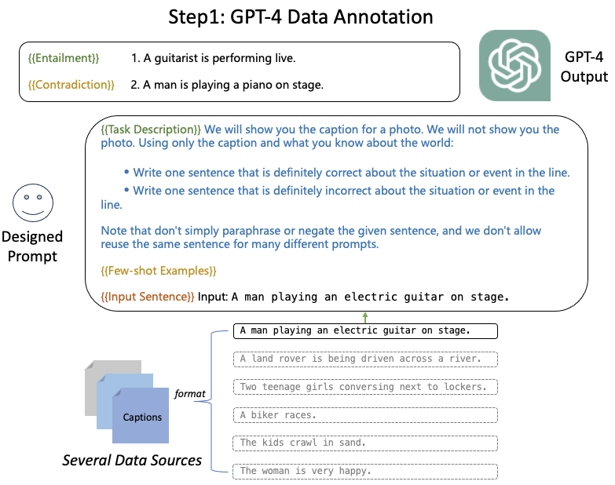
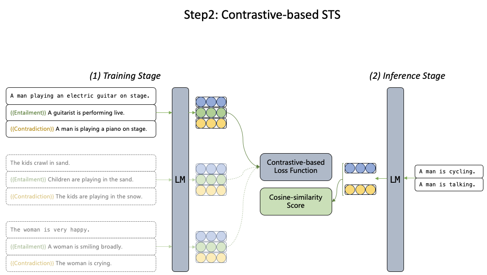

# Sim-GPT: Text Similarity via GPT Synthesized Data

This repo is for our paper: [Sim-GPT: Text Similarity via GPT Synthesized Data](). 

In this repo you can find:
* Scripts to reproduce our results.
* Non-labeled and labeled data used in our paper.
* Best models demonstrated in our paper.

## Upate

* November XX, 2023 we released our paper: [arxiv]().


## Links
- [Sim-GPT: Text Similarity via GPT Synthesized Data](#sim-gpt-text-similarity-via-gpt-synthesized-data)
  - [Upate](#upate)
  - [Links](#links)
  - [Introduction](#introduction)
  - [Reproduce](#reproduce)
    - [Requriements](#requriements)
      - [OpenAI Access](#openai-access)
      - [SimCSE Training](#simcse-training)
      - [PromCSE Training](#promcse-training)
    - [GPT-4 Data Annotation](#gpt-4-data-annotation)
    - [Training STS Models](#training-sts-models)
    - [Evaluation](#evaluation)
  - [Released Best Models](#released-best-models)
  - [Released GPT-4 Labeled Data](#released-gpt-4-labeled-data)
    - [Captions](#captions)
    - [Questions](#questions)
    - [Multi-genre Sentences](#multi-genre-sentences)
  - [Contact](#contact)

## Introduction
To address the longstanding issue with the STS task: the lack of a large collection of high-quality labeled training data, we propose Sim-GPT generating data with STS labels using GPT-4, based on which an STS model is trained.

Sim-GPT does not directly ask LLMs (e.g., GPT-4) to provide STS scores for a newly-encounter sentence pair. But rather, it firstly asks LLMs to generate a relatively large set of training data; 
secondly, a smaller model (e.g., backboned by RoBERTa) is trained based on the synthesized data from LLMs; At test time, the trained model is used for inference. 

Illustraitions for our Sim-GPT is following:





## Reproduce

### Requriements
#### OpenAI Access
* python>=3.7.3
* openai>=0.27.2

#### SimCSE Training
For training SimCSE models, we followed: [this repo](https://github.com/princeton-nlp/SimCSE). To save your time, we directly copy them as following:

```
transformers==4.2.1
scipy
datasets
pandas
scikit-learn
prettytable
gradio
torch
setuptools
```

#### PromCSE Training
For training PromCSE models, we followed: [this repo](https://github.com/YJiangcm/PromCSE). To save your time, we directly copy them as following:

```
transformers==4.2.1
scipy==1.5.4
datasets==1.2.1
pandas==1.1.5
scikit-learn==0.24.0
prettytable==2.1.0
gradio
torch
setuptools==49.3.0
```

### GPT-4 Data Annotation
Here, we provide links to download source data and prompts to instruct GPT-4 to do annotation.

Source data links:


### Training STS Models

### Evaluation


## Released Best Models

## Released GPT-4 Labeled Data

### Captions

### Questions

### Multi-genre Sentences

## Contact