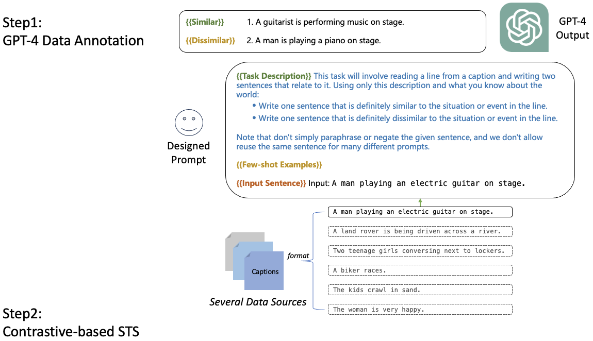
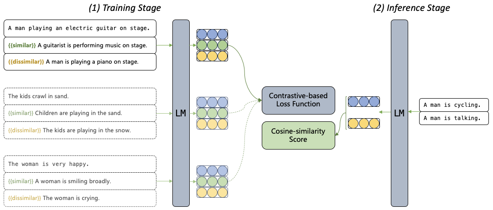

# Sim-GPT: Text Similarity via GPT Annotated Data

This repo is for our paper: [Sim-GPT: Text Similarity via GPT Annotated Data](https://arxiv.org/abs/2312.05603). 

In this repo you can find:
* Scripts to reproduce our results.
* Non-labeled and labeled data used in our paper.
* Best checkpoints demonstrated in our paper.

## Upate

* December 12, 2023 we released our scripts, checkpoints and data.
* December 12, 2023 we released our paper in [arxiv](https://arxiv.org/abs/2312.05603).


## Links
- [Sim-GPT: Text Similarity via GPT Annotated Data](#sim-gpt-text-similarity-via-gpt-annotated-data)
  - [Upate](#upate)
  - [Links](#links)
  - [Introduction](#introduction)
  - [Reproduce](#reproduce)
    - [Step 1: Requriements](#step-1-requriements)
      - [1. OpenAI Requriements](#1-openai-requriements)
      - [2. SimCSE Requriements](#2-simcse-requriements)
      - [3. PromCSE Requriements](#3-promcse-requriements)
    - [Step 2: GPT-4 Data Annotation](#step-2-gpt-4-data-annotation)
      - [1. Download Source Data](#1-download-source-data)
      - [2. GPT-4 Annotation](#2-gpt-4-annotation)
    - [Step 3: Training STS Models](#step-3-training-sts-models)
    - [Step 4: Evaluation](#step-4-evaluation)
    - [Step 5: Results](#step-5-results)
  - [Released Checkpoints](#released-checkpoints)
  - [Released GPT-4 Annotated Data](#released-gpt-4-annotated-data)
  - [Contact](#contact)

## Introduction
To address the longstanding issue with the STS task: the lack of a large collection of high-quality labeled training data, we propose Sim-GPT. This approach involves using GPT-4 to generate data with STS labels, upon which an STS model is subsequently trained.

Sim-GPT does not directly ask LLMs (e.g., GPT-4) to provide STS scores for a newly-encountered sentence pair. But rather, it firstly asks LLMs to generate a relatively large set of training data; 
secondly, a smaller model (e.g., backboned by RoBERTa) is trained based on the synthesized data from LLMs; At test time, the trained model is used for inference. 

Illustraitions for our Sim-GPT is following:





## Reproduce

### Step 1: Requriements
#### 1. OpenAI Requriements
* python>=3.7.3
* openai>=0.27.2

#### 2. SimCSE Requriements
For training SimCSE models, we followed: [SimCSE](https://github.com/princeton-nlp/SimCSE). To be efficient, we have directly copied them as follows for your convenience:

```
transformers==4.2.1
scipy
datasets
pandas
scikit-learn
prettytable
gradio
torch
setuptools
```

#### 3. PromCSE Requriements
For training PromCSE models, we followed: [PromCSE](https://github.com/YJiangcm/PromCSE). To be efficient, we have directly copied them as follows for your convenience:

```
transformers==4.2.1
scipy==1.5.4
datasets==1.2.1
pandas==1.1.5
scikit-learn==0.24.0
prettytable==2.1.0
gradio
torch
setuptools==49.3.0
```

### Step 2: GPT-4 Data Annotation
In this part, we offer links to download the source data and provide prompts that guide GPT-4 in the annotation process.

#### 1. Download Source Data
Three types of data:
* [Captions (Flickr30K)](https://www.kaggle.com/datasets/hsankesara/flickr-image-dataset)
* [Questions (Quora Question Pairs)](https://www.kaggle.com/datasets/quora/question-pairs-dataset)
* For Multi-genre long sentences, we only release the annotated version.

#### 2. GPT-4 Annotation
Prompts:
* Captions: `./prompts/captions.txt`
* Questions: `./prompts/questions.txt`
* Multi-genre Sentences: `./prompts/multi_genre_sentences.txt`

It's worth noting that for several reasons while accessing GPT-4 (e.g, bacth size, network), 
the data re-created using the above prompts may vary slightly from the dataset we have released. 
As mentioned in our paper, despite significant variations in the prompt, the performance of the model, when trained on the generated data, tends to remain consistent for the STS task.


### Step 3: Training STS Models

1. Clone the related project:
   1. [SimCSE](https://github.com/princeton-nlp/SimCSE)
   2. [PromCSE](https://github.com/YJiangcm/PromCSE)
2. Download backboned RoBERTa models:
   1. [RoBERTa-base](https://huggingface.co/roberta-base)
   2. [RoBERTa-large](https://huggingface.co/roberta-large)
3. Fill the `roberta path`, `input file` and `output directory` into our provided training scripts:
   1. SimCSE-RoBERTa
      1. base: `./training-parameters/simcse/sup_roberta_base.sh`
      2. large: `./training-parameters/simcse/sup_roberta_large.sh`
   2. PromCSE-RoBERTa
      1. base: `./training-parameters/promcse/sup_roberta_base.sh`
      2. large: `./training-parameters/promcse/sup_roberta_large.sh`
4. Move modified scripts to the directory of the related projects, such as:
   1. `move ./training-parameters/simcse/sup_roberta_base.sh SimCSE/`
5. Run the training scirpt, such as: `bash SimCSE/sup_roberta_base.sh`


### Step 4: Evaluation
We evaluate Sim-GPT on 7 STS tasks, and report the score of Spearman's correlation.

1. Clone the related project:
   1. [SimCSE](https://github.com/princeton-nlp/SimCSE)
   2. [PromCSE](https://github.com/YJiangcm/PromCSE)
2. Run the official evaluation code, for example:
```
python SimCSE/evaluation.py \
    --model_name_or_path simgpt-simcse-roberta-large \
    --pooler cls \
    --task_set sts \
    --mode test
```
which is expected to output the results in a tabular format:
```
+-------+-------+-------+-------+-------+--------------+-----------------+-------+
| STS12 | STS13 | STS14 | STS15 | STS16 | STSBenchmark | SICKRelatedness |  Avg. |
+-------+-------+-------+-------+-------+--------------+-----------------+-------+
| 78.79 | 88.22 | 83.48 | 88.32 | 85.48 |    87.91     |      81.07      | 84.75 |
+-------+-------+-------+-------+-------+--------------+-----------------+-------+
```


### Step 5: Results
Table 1: Results reported in our paper on 7 STS tasks.
<table border=2>
    <tr>
        <td align="left"><b> Model </b> </td>
        <td align="center"><b> STS12 </b> </td>
        <td align="center"><b> STS13 </b> </td>
        <td align="center"><b> STS14 </b> </td>
        <td align="center"><b> STS15 </b> </td>
        <td align="center"><b> STS16 </b> </td>
        <td align="center"><b> STS-B </b> </td>
        <td align="center"><b> SICK-R </b> </td>
        <td align="center"><b> Avg </b> </td>
    </tr>
    <tr>
        <td align="center" colspan="9"> Supervised Model </td> 
    </tr>
    <tr>
        <td>InferSent-GloVe</td> 
        <td>52.86</td> 
        <td>66.75</td> 
        <td>62.15</td>
        <td>72.77</td>
        <td>66.87</td>
        <td>68.03</td>
        <td>65.65</td>
        <td>65.01</td>
    </tr>
    <tr>
        <td>Universal Sentence Encoder</td> 
        <td>64.49</td> 
        <td>67.80</td> 
        <td>64.61</td>
        <td>76.83</td>
        <td>73.18</td>
        <td>74.92</td>
        <td>76.69</td>
        <td>71.22</td>
    </tr>
    <tr>
        <td>SRoBERTa-base</td> 
        <td>71.54</td> 
        <td>72.49</td> 
        <td>70.80</td>
        <td>78.74</td>
        <td>73.69</td>
        <td>77.77</td>
        <td>74.46</td>
        <td>74.21</td>
    </tr>
    <tr>
        <td>SBERT-base</td> 
        <td>70.97</td> 
        <td>76.53</td> 
        <td>73.19</td>
        <td>79.09</td>
        <td>74.30</td>
        <td>77.03</td>
        <td>72.91</td>
        <td>74.89</td>
    </tr>
    <tr>
        <td>CT-SBERT-base</td> 
        <td>74.84</td> 
        <td>83.20</td> 
        <td>78.07</td>
        <td>83.84</td>
        <td>77.93</td>
        <td>81.46</td>
        <td>76.42</td>
        <td>79.39</td>
    </tr>
    <tr>
        <td align="center" colspan="9"> SimGPT - SimCSE </td> 
    </tr>
    <tr>
        <td>SimCSE-RoBERTa-base</td> 
        <td>76.53</td> 
        <td>85.21</td> 
        <td>80.95</td>
        <td>86.03</td> 
        <td>82.57</td> 
        <td>85.83</td>
        <td>80.50</td> 
        <td>82.52</td> 
    </tr> 
    <tr>
        <td>SimGPT - SimCSE-RoBERTa-base</td> 
        <td>77.65 (+1.12)</td> 
        <td>86.15 (+0.94)</td> 
        <td>80.58 (-0.37)</td>
        <td>86.47 (+0.44)</td> 
        <td>84.08 (+1.51)</td> 
        <td>86.20 (+0.37)</td>
        <td>80.88 (+0.38)</td> 
        <td><b>83.14 (+0.62)</b></td> 
    </tr> 
    <tr>
        <td>SimCSE-RoBERTa-large</td> 
        <td>77.46</td> 
        <td>87.27</td> 
        <td>82.36</td>
        <td>86.66</td> 
        <td>83.93</td> 
        <td>86.70</td>
        <td>81.95</td> 
        <td>83.76</td> 
    </tr> 
    <tr>
        <td>SimGPT - SimCSE-RoBERTa-large</td> 
        <td>78.79 (+1.33)</td> 
        <td>88.22 (+0.95)</td> 
        <td>83.48 (+1.12)</td>
        <td>88.32 (+1.66)</td> 
        <td>85.48 (+1.55)</td> 
        <td>87.91 (+1.21)</td>
        <td>81.07 (-0.88)</td> 
        <td><b>84.75 (+0.99)</b></td> 
    </tr> 
    <tr>
        <td align="center" colspan="9"> SimGPT - PromCSE </td> 
    </tr>
    <tr>
        <td>PromCSE-RoBERTa-base</td> 
        <td>77.51</td> 
        <td>86.15</td> 
        <td>81.59</td>
        <td>86.92</td> 
        <td>83.81</td> 
        <td>86.35</td>
        <td>80.49</td> 
        <td>83.26</td> 
    </tr> 
    <tr>
        <td>SimGPT - PromCSE-RoBERTa-base</td> 
        <td>77.74 (+0.23)</td> 
        <td>86.82 (+0.77)</td> 
        <td>81.36 (-0.23)</td>
        <td>87.01 (+0.09)</td> 
        <td>84.58 (+0.77)</td> 
        <td>86.98 (+0.63)</td>
        <td>80.48 (-0.01)</td> 
        <td><b>83.57 (+0.31)</b></td> 
    </tr> 
    <tr>
        <td>PromCSE-RoBERTa-large</td> 
        <td>79.56</td> 
        <td>88.97</td> 
        <td>83.81</td>
        <td>88.08</td> 
        <td>84.96</td> 
        <td>87.87</td>
        <td>82.43</td> 
        <td>85.10</td> 
    </tr> 
    <tr>
        <td>SimGPT - PromCSE-RoBERTa-large</td> 
        <td>79.92 (+0.36)</td> 
        <td>88.87 (-0.10)</td> 
        <td>84.29 (+0.48)</td>
        <td>88.64 (+0.56)</td> 
        <td>85.94 (+0.98)</td> 
        <td>88.18 (+0.31)</td>
        <td>82.79 (+0.36)</td> 
        <td><b>85.52 (+0.42)</b></td> 
    </tr> 
    
</table>


## Released Checkpoints
|              Model              | Avg. STS |
|:-------------------------------|:--------:|
|  [simgpt-simcse-roberta-base](https://drive.google.com/drive/folders/16dLNL_fDI3Vu7FZzo0VRpQo1Kp98YoNm?usp=sharing) |   83.14 |
| [simgpt-simcse-roberta-large](https://drive.google.com/drive/folders/1F9eLNDIt3nrI_HvC452eq3seKgJtXNjz?usp=sharing) |   84.75  |
|    [simgpt-promcse-roberta-base](https://drive.google.com/drive/folders/1B32cOC9421ORHfKC_pJc_FuRTw-FMTIj?usp=sharing)    |   83.57  |
|    [simgpt-promcse-roberta-large](https://drive.google.com/drive/folders/12T1cWvYC7YtajQGh4nUPE9T0kbcbGQFz?usp=sharing)   |   85.52  |

## Released GPT-4 Annotated Data
Our released annotated data are:
* [Captions](https://drive.google.com/file/d/1wqy1vYLfe1fg01DMjsGAzbf46u6KOt5o/view?usp=sharing)
* [Questions](https://drive.google.com/file/d/1-aSCCoupDQvojk1wHNLsoJnPd-lSYwPN/view?usp=sharing)
* [Multi-genre long sentences](https://drive.google.com/file/d/1vvejC0RZadq0B7nZZCaay5B0HLIXaJsW/view?usp=sharing)
* [Final Training Data](https://drive.google.com/file/d/1hcOwNn2b6730yb8HyM_uyaTtPc5sBCys/view?usp=sharing)

## Contact
If you have any issues or questions about this repo, feel free to contact wangshuhe@stu.pku.edu.cn